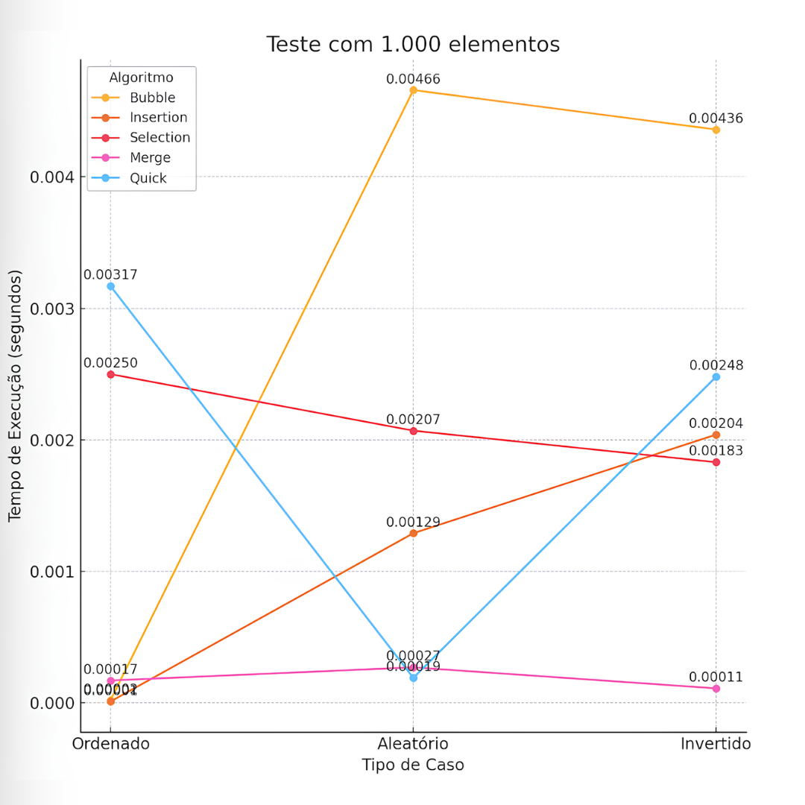
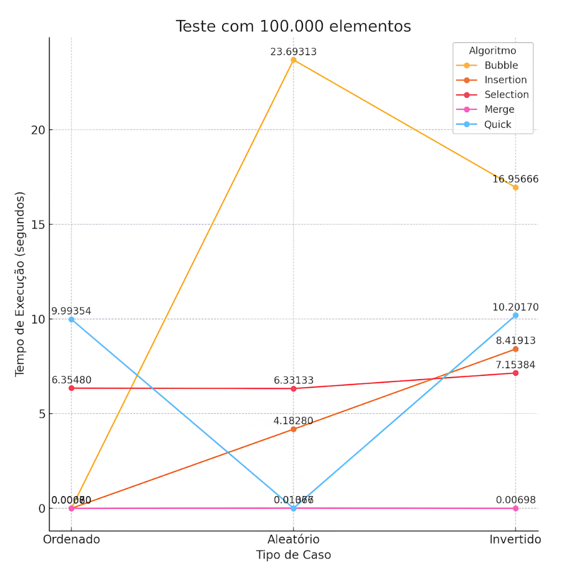
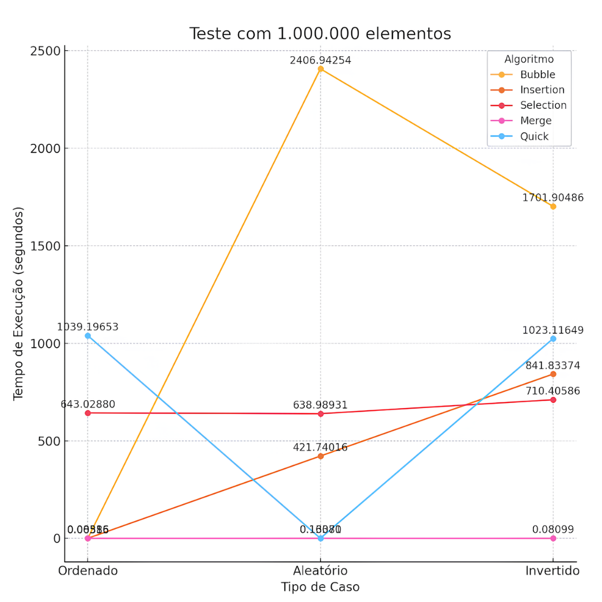

# Análise de Desempenho de Algoritmos de Ordenação em C

Este projeto foi desenvolvido como parte da disciplina de Estruturas de Dados, com o objetivo de explorar e comparar o desempenho de diferentes algoritmos de ordenação. A análise é baseada em métodos comuns, utilizando uma abordagem prática e quantitativa para mensurar a eficiência de cada algoritmo.

## Sobre os algoritmos utilizados...

- **Bubble Sort**: Troca repetidamente elementos adjacentes até que a lista esteja ordenada. Simples, mas lento para listas grandes ou desordenadas.
- **Insertion Sort**: Insere cada elemento na posição correta em uma sublista ordenada. Eficiente para listas pequenas ou quase ordenadas.
- **Selection Sort**: Seleciona o menor elemento em cada iteração e o coloca na posição final. Simples, mas menos eficiente para listas grandes devido ao número de comparações.
- **Merge Sort**: Divide a lista em sublistas até que estejam ordenadas e depois as combina. Estável e eficiente para listas grandes.
- **Quick Sort**: Escolhe um pivô e particiona a lista em torno dele. Geralmente o mais rápido para listas grandes, mas a implementação recursiva pode causar falhas de segmentação em listas muito grandes. Para evitar isso, uma implementação iterativa pode ser usada, que utiliza uma pilha explícita para gerenciar as sublistas a serem ordenadas.

## Casos de teste 🔎

Foram realizados testes com três categorias de vetores:
- **Ordenado (melhor caso)**: Testa a eficiência dos algoritmos quando os dados já estão organizados.
- **Aleatório (caso médio)**: Avalia a execução em uma situação intermediária, mais próxima dos cenários reais.
- **Invertido (pior caso)**: Mede o desempenho em uma configuração onde a ordem dos elementos é oposta à esperada.

Os tamanhos dos vetores testados foram: `1.000`, `100.000` e `1.000.000` elementos.

## Implementação 👾

A implementação do programa foi realizada em C, com base nos estudos conduzidos pelo professor Ednilson e na análise comparativa de SOUZA, Jackson EG; RICARTE, João Victor G.; e DE ALMEIDA LIMA, Náthalee Cavalcanti. Foram adicionados contadores que registram o número de comparações, trocas e o tempo de execução, permitindo uma análise detalhada do desempenho de cada algoritmo.

Para gerenciar e compilar o projeto em diferentes diretórios, foi criado um **Makefile** que organiza a compilação de todos os arquivos, garantindo uma execução eficiente do programa.

### Estrutura do projeto 

A estrutura de pastas do projeto é organizada da seguinte forma:

```
/projeto_ordenacao
|-- main.c             
|-- Makefile
|-- lib    
|   |-- sort.c           
|   |-- sort.h
|   |-- casos.c          
|   |-- casos.h
|   |-- utils.c         
|   |-- utils.h
```

- **main.c**: Contém a função principal, responsável por orquestrar a execução do programa e realizar os testes de desempenho.
- **lib/sort.c e lib/sort.h**: Arquivos que contêm a implementação e as declarações dos algoritmos de ordenação.
- **lib/casos.c e lib/casos.h**: Funções para preencher os vetores com diferentes cenários de teste (caso ordenado, inverso, aleatório, etc.).
- **lib/utils.c e lib/utils.h**: Funções auxiliares, como a geração de números aleatórios e a medição precisa do tempo de execução.
- **Makefile**: Script que automatiza a compilação do projeto, facilitando o processo de compilação e execução.

## Como compilar e executar o projeto?👩🏻‍💻

Para compilar e executar o projeto, siga os passos abaixo:

1. **Abra o terminal** e navegue até o diretório do projeto.

2. **Compile o projeto** utilizando o comando `make`:
   ```sh
   make
   ```

3. **Execute o programa** utilizando o comando `./main`:
   ```sh
   ./main
   ```

Esses comandos irão compilar todos os arquivos necessários e executar o programa principal, permitindo que você veja os resultados dos testes de desempenho dos algoritmos de ordenação.

## Resultados dos testes 📊

Os testes foram realizados três vezes para cada vetor, e as médias dos resultados obtidos estão apresentadas em tabelas descritivas no arquivo `algorithms_performance.xlsx`, localizado na pasta `charts`. As tabelas incluem os casos de teste, o número de comparações, trocas e o tempo de execução para cada algoritmo.

Para visualizar os resultados detalhados, [clique aqui para acessar o arquivo `algorithms_performance.xlsx`](./charts/algorithms_performance.xlsx).

## Interpretação dos Resultados 📈

### `Gráfico 1`: Teste com 1.000 elementos

- **Caso Ordenado**: O método **Insertion Sort** é o mais eficiente, com tempo de execução de apenas **0,00001 segundos**, pois se beneficia da ordenação pré-existente e realiza poucas operações. Por outro lado, o **Quick Sort** é o mais lento, com **0,00317 segundos**, pois ele ainda realiza divisões e comparações em toda a lista, sem tirar proveito da ordem inicial dos elementos.
  
- **Caso Aleatório**: O **Quick Sort** apresenta o melhor desempenho, levando apenas **0,00019 segundos**. O **Bubble Sort** é o mais lento, demorando **0,00466 segundos**, devido ao número elevado de comparações e trocas necessárias para ordenar uma lista aleatória.
  
- **Caso Invertido**: O **Merge Sort** se destaca, com **0,00011 segundos**. O **Bubble Sort** novamente apresenta o pior desempenho, com **0,00436 segundos**, pois precisa efetuar diversas trocas para reorganizar os elementos invertidos.

    

### `Gráfico 2`: Teste com 100.000 elementos

- **Caso Ordenado**: O **Bubble Sort** é o mais eficiente, com **0,00060 segundos**. O **Quick Sort**, porém, é o mais demorado, com **9,99354 segundos**, o que pode ser explicado por uma má escolha do pivô inicial em listas ordenadas.
  
- **Caso Aleatório**: O **Quick Sort** é o mais rápido, executando em **0,01076 segundos**. Já o **Bubble Sort** continua sendo o mais lento, com **23,69313 segundos**, devido ao elevado número de comparações e trocas.

- **Caso Invertido**: O **Merge Sort** apresenta a melhor performance com **0,00698 segundos**. O **Bubble Sort** demora mais, levando **16,95666 segundos**, com muitas trocas em uma lista totalmente invertida.

    

### `Gráfico 3`: Teste com 1.000.000 elementos

- **Caso Ordenado**: **Bubble Sort** é o mais rápido, levando **0,00385 segundos**. O **Quick Sort** leva o maior tempo, **1039,19653 segundos**, mais uma vez impactado negativamente pela escolha do pivô em uma lista ordenada.
  
- **Caso Aleatório**: **Quick Sort** realiza o trabalho em **0,13071 segundos**, sendo o método mais eficiente. O **Bubble Sort** é o mais lento, com **2406,94254 segundos**, onde o volume de elementos e trocas torna o processo extremamente demorado.
  
- **Caso Invertido**: **Merge Sort** é o mais rápido, com **0,08099 segundos**. O **Bubble Sort** é, novamente, o mais lento, com **1701,90486 segundos** para reordenar uma lista invertida.

    

### Conclusão geral 

O `Merge Sort` mostrou-se consistentemente eficiente em diferentes casos e quantidades de elementos, enquanto o `Bubble Sort` teve desempenho significativamente pior em casos de listas aleatórias e invertidas. A análise reforça a importância de escolher o algoritmo adequado para cada cenário de ordenação.

## Referência

SOUZA, Jackson EG; RICARTE, João Victor G.; DE ALMEIDA LIMA, Náthalee Cavalcanti. Algoritmos de Ordenação: Um estudo comparativo. Anais do Encontro de Computação do Oeste Potiguar ECOP/UFERSA (ISSN 2526-7574), n. 1, 2017.
